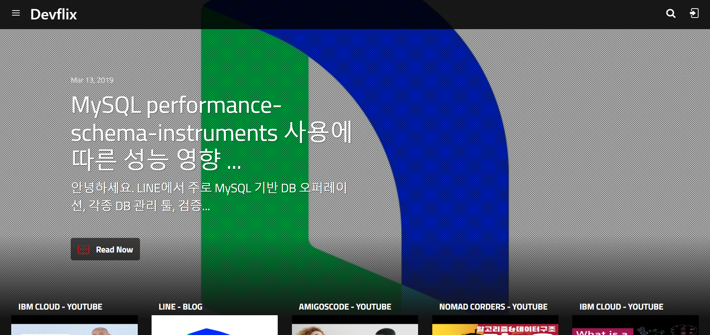
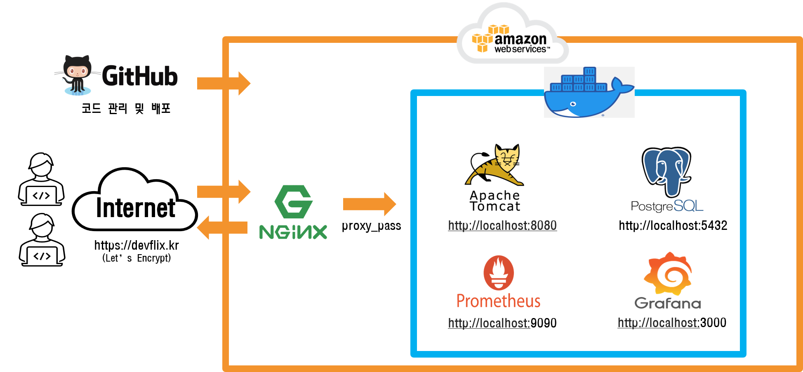

# :seedling: [Devflix](https://devflix.kr/)    

    

## :pushpin: 개요    

&nbsp;&nbsp;&nbsp;&nbsp;:heavy_check_mark: 카카오, 네이버, 라인, 우아한 형제들 등 개발 블로그 포스트 크롤링 하여 Devflix에서 확인.    
&nbsp;&nbsp;&nbsp;&nbsp;:heavy_check_mark: 코딩 및 개발자 관련 소식 Youtuber 영상 크롤링 하여 Devflix에서 확인.   
&nbsp;&nbsp;&nbsp;&nbsp;:heavy_check_mark: 크롤링 된 개발 포스트에 관련하여 궁금한 사항있을 시, Devflix 게시판에 글과 함께 공유.   

## :pushpin: 사용 기술 및 개발환경    

                 

## :pushpin: 프로젝트 중점 사항    

&nbsp;&nbsp;&nbsp;&nbsp;:heavy_check_mark: Scheduling을 통해 크롤링 작업을 자동화.    
&nbsp;&nbsp;&nbsp;&nbsp;:heavy_check_mark: JUnit5을 통한 단위, 통합 테스트를 진행하여 생산성 및 코드 신뢰성 향상 노력.    
&nbsp;&nbsp;&nbsp;&nbsp;:heavy_check_mark: docker를 사용함으로써 docker 환경 이해와 환경 구성 노력.    
&nbsp;&nbsp;&nbsp;&nbsp;:heavy_check_mark: prometheus와 grafana를 통해 서버 모니터링을 진행하여 서버 메모리를 효율적으로 관리 및 메모리 사용률 체크.
&nbsp;&nbsp;&nbsp;&nbsp;&nbsp;&nbsp;&nbsp; - monitering 주소: http://54.180.99.109:82    
&nbsp;&nbsp;&nbsp;&nbsp;:heavy_check_mark: REST 아키텍처 제약 조건을 준수하여 RESTful API 설계 및 구현.    
&nbsp;&nbsp;&nbsp;&nbsp;:heavy_check_mark: Spring Security를 통해 사용자 인증, 인가 기능 구현.    
&nbsp;&nbsp;&nbsp;&nbsp;:heavy_check_mark: open souce인 [Lucy XSS Filter Servlet](https://github.com/naver/lucy-xss-servlet-filter)을 통해 filter에서 parmater에 포함된 특수문자를 치환하여 XSS 공격 방지.   
&nbsp;&nbsp;&nbsp;&nbsp;:heavy_check_mark: [Let's Encrypt](https://letsencrypt.org/)를 통해 SSL 무료 인증서를 받아 https 적용과 [certbot](https://github.com/certbot/certbot)을 통해 Let's Encrypt 인증서 자동 재갱신.     

## :pushpin: 주요 기능    

&nbsp;&nbsp;&nbsp;&nbsp; 1.인증 및 인가 기능    
&nbsp;&nbsp;&nbsp;&nbsp; 2.게시글 작성    
&nbsp;&nbsp;&nbsp;&nbsp; 3.등록된 포스트 조회    
&nbsp;&nbsp;&nbsp;&nbsp; 4.댓글 기능    
&nbsp;&nbsp;&nbsp;&nbsp; 5.댓글 알람 기능    

## :pushpin: Devflix 구성도    

    

## :pushpin: 참고 사이트    

* Spring Framework Document    
  :bookmark_tabs: [Spring Framework Document](https://docs.spring.io/spring-framework/docs/current/reference/html/)
* Youtube API Reference    
  :bookmark_tabs: [Youtube API Reference](https://developers.google.com/youtube/v3/docs?hl=ko)
* QueryDSL 래퍼런스 문서 - 한글 번역    
  :bookmark_tabs: [QueryDSL Reference](http://www.querydsl.com/static/querydsl/4.0.1/reference/ko-KR/html_single/)
* Spring Security 래퍼런스 문서 - 한글 번역    
  :bookmark_tabs: [리맘의 한글라이즈 프로젝트](https://godekdls.github.io/Spring%20Security/authentication/)
* HtmlUnit Reference    
  :bookmark_tabs: [HtmlUnit Reference](https://htmlunit.sourceforge.io/frame-howto.html)
  
  